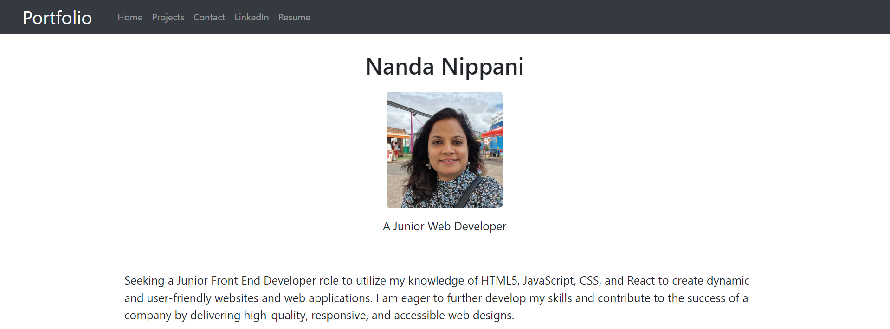

# Portfolio created using ReactJS
## Description
This application shows my portfolio using React showing information such as photo, brief description, front-end projects, contact information and PDF resume.

## Main Page  
This page shows main page of my portfolio.
  

This page shows projets page

This page shows contact page

This page shows PDF version of my resume

## URL of Deployed Application
https://nandanippani.github.io/react-portfolio-dep/

## URL of Github repository that contains application code
https://github.com/Nandanippani/react-portfolio

## Installation
N/A

## Usage
This project is used to demonstrate ability to use ReactJS,  HTML, CSS and JavaScript.

## Credits
N/A

## License
N/A
